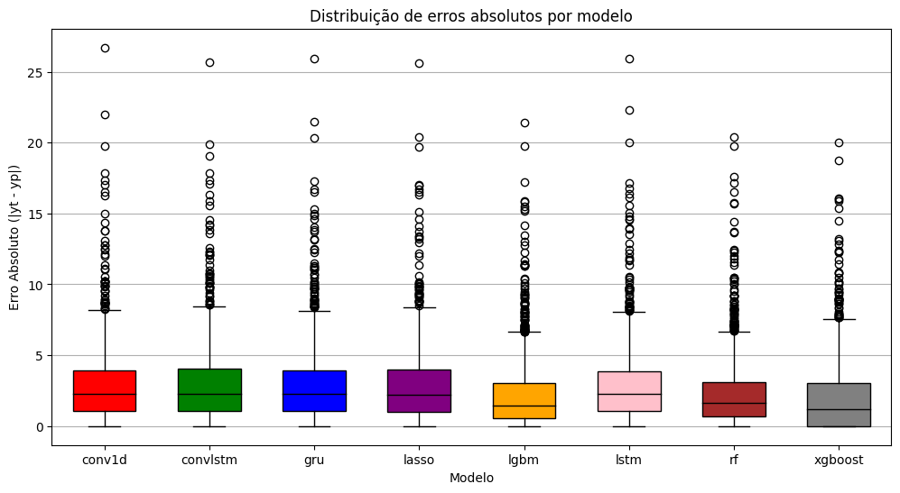

# Imputação de Dados de NO2: Repositório de Código

Este repositório é dedicado à estimativa da concentração de dióxido de nitrogênio (NO2) na coluna troposférica. Ele utiliza dados do sensor TROPOMI do satélite Sentinel-5P, empregando técnicas avançadas de Aprendizado de Máquina. O objetivo principal é aprimorar a precisão dos dados em regiões tropicais, com foco na Amazônia do Pará, uma área frequentemente afetada por nuvens. Este trabalho é crucial para o monitoramento da qualidade do ar e para a compreensão dos impactos das atividades humanas em uma região essencial ao equilíbrio ambiental global.

## Estrutura do Repositório

### Instalação das Dependências
Para configurar o ambiente necessário, execute:

```bash
pip install -r requirements.txt
```

### Organização dos Diretórios
- `src`: Códigos-fonte do projeto.
  - `data`: Códigos para o pré-processamento de dados.
  - `models`: Códigos dos modelos de Machine Learning e DataLoaders.
  - `viz`: Códigos para visualizações de dados.

## Utilização do Repositório

### Configuração de Dados de Coleta
- `points.json`: Contém o GeoJSON para pontos de coleta de dados. Modifique conforme necessário.

### Configuração e Download de Datasets
- `datasets.yml`: Configurações para o download de datasets via API Python do Google Earth Engine.

Para baixar o dataset após alterações no YAML, execute:

```bash
python3 dataset.py
```

### Scripts para Treinamento e Download
- Localizados em `scripts`, incluem todos os scripts para download e treinamento dos modelos.
- `dataset_pipeline.sh`: Script para transformar os dados baixados no formato do dataset de treinamento.
  
  **Incluir Figura do Pipeline**

- `infer.sh`: Realiza inferências usando modelos treinados, baseando-se nos caminhos dos pesos de cada modelo.

## Resultados e Conclusão

<p align="justify">
A Tabela a seguir apresenta uma visão quantitativa comparativa dos resultados obtidos por cada modelo, destacando as principais métricas de avaliação.
</p>

| Modelo        | R²          | r | MSE | RMSE | MAE |
|:-------------|:----|:----|:------|:------|:------|
| Lasso | 0.23 | 0.48  | 14.70  | 3.83  | 2.84  |
| RF | 0.43 | 0.66 | 10.97 | 3.31 | 2.30 |
| **XGBoost** | **0.47** | **0.68** | **10.17** | **3.19** | **2.00** |
| LightGBM | 0.44 | 0.66 | 10.66 | 3.26 | 2.20 |
| Conv1D | 0.21 | 0.46 | 15.16 | 3.89 | 2.90 |
| GRU | 0.21 | 0.45 | 15.15 | 3.89 | 2.88 |
| LSTM | 0.22 | 0.47 | 14.90 | 3.86 | 2.86 |
| ConvLSTM | 0.19 | 0.43 | 15.53 | 3.94 | 2.92 |

<p align="justify">
Nota-se que os modelos baseados em árvores de decisão como XGBoost, Random Forest e LightGBM superaram os modelos lineares e redes neurais nas métricas de avaliação. O XGBoost destacou-se por lidar melhor com a complexidade dos dados, enquanto o desempenho inferior das redes neurais sugere desafios em capturar dependências não sequenciais ou a necessidade de mais dados para treinamento.
</p>

<p  align="center">
    
    <em> <b>Figura 3: </b>Distribuição de erros absolutos por modelo, mostrando a comparação de desempenho entre LightGBM, XGBoost, Random Forest (RF), AdaBoost, GRU, Lasso, ConvLSTM e LSTM</em>
</p>

<p align="justify">
Os boxplots mostram que modelos de Machine Learning como LightGBM, XGBoost e Random Forest têm um desempenho notavelmente melhor, com erros menores e menos variabilidade, enquanto o AdaBoost tem uma dispersão maior de erros e as redes neurais, incluindo GRU, LSTM e ConvLSTM, apresentam os maiores erros e mais outliers, indicando a necessidade de mais dados ou de dados mais complexos.
</p>

### Conclusão

<p align="justify">
O projeto demonstrou que a metodologia empregada para estimar a concentração de NO2 na coluna troposférica é viável e eficaz, com destaque para os modelos baseados em árvore que apresentaram resultados notáveis. Apesar dos modelos de deep learning não terem atingido o mesmo nível de sucesso, eles oferecem uma base importante para pesquisas e aprimoramentos futuros.
</p>

## Contribuidores
A lista de contribuidores desse projeto é:
<table>
  <tr>
    <td align="center"><a href="https://github.com/WesPereira"><br /><sub><b>WesPereira</b></sub></a><br /></td>
  </tr>
</table>