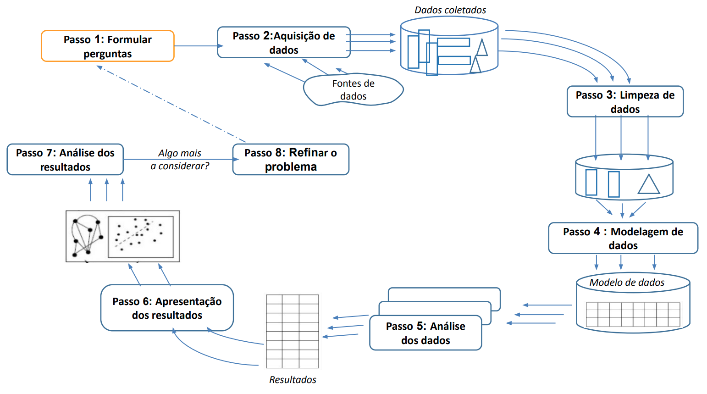
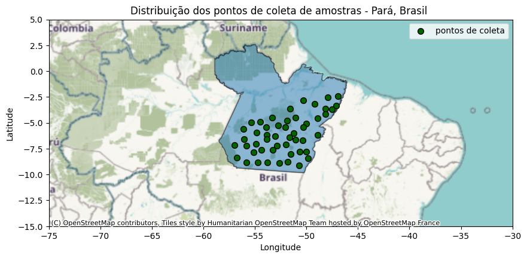

# Contexto e Motivação

<p align="justify">
O uso de dados de sensoriamento remoto é crucial no monitoramento das mudanças ambientais globais e na observação da Terra, especialmente na região do Pará, Brasil, onde a Amazônia enfrenta desafios devido à atividade humana. Dados do satélite Sentinel-5P e seu instrumento TROPOMI são fundamentais para monitorar a qualidade do ar e a concentração de dióxido de nitrogênio (NO2), ajudando a avaliar o impacto do desmatamento e queimadas na atmosfera amazônica.
</p>

## Objetivo

<p align="justify">
Este trabalho visa <b>desenvolver e avaliar modelos de Aprendizado de Máquina para estimar a concentração de NO2 na coluna troposférica </b>, usando dados do sensor TROPOMI do satélite Sentinel-5P. Focando na Amazônia, o estudo busca superar dificuldades na coleta de dados precisos devido à presença de nuvens, contribuindo para o monitoramento da qualidade do ar e entendimento dos impactos humanos no equilíbrio ambiental global.
</p>

# Metodologia

## Pipeline de pré-processamento

<p align="justify">
O trabalho foi desenvolvido seguindo uma metodologia de ciclo de experimento, conforme ilustrado na figura abaixo. Esse processo inclui desde a fase inicial de coleta de dados até as etapas subsequentes de análise dos resultados.
</p>

<p  align="center">
    
    <em> <b>Figura 1: </b>Diagrama do ciclo de experimento um experimento de dados em oito passos</em>
</p>

## Estudo de Caso
<p align="justify">
O desenvolvimento foi estruturado em torno de um estudo de caso, onde, para treinar os modelos, selecionaram-se aleatoriamente 50 pontos no estado do Pará, Brasil, para coletar variáveis de sensoriamento remoto associadas à concentração de NO2.
</p>

<p  align="center">
    
    <em> <b>Figura 2: </b>Mapa da distribuição geográfica dos pontos de coleta de amostras no estado do Pará, Brasil</em>
</p>

## Seleção das variáveis independentes

<p align="justify">
Os critérios estabelecidos para a escolha das variáveis de sensoriamento remoto (variáveis independentes) empregadas na estimativa da concentração de NO2 foram os seguintes:
    <ol>
      <li>Disponibilidade do dado via API do Google Earth Engine;</li>
      <li>Resolução temporal diária;</li>
      <li>Possível correlação/influência com a concentração da coluna troposférica de NO2 do ponto de vista físico;</li>
    </ol>

Assim, as seguintes variáveis foram selecionadas baseadas nos críterios definidos acima:
</p>

| Nome da variável        | Código da Coleção          | Res. espacial (m) |
|:-------------|:------------------|:------|
| ```Optical_Depth_047```           | ```MODIS/061/MCD19A2_GRANULES``` | 1000  |
| ```Column_WV```           | ```MODIS/061/MCD19A2_GRANULES``` | 1000  |
| ```precipitationCal```           | ```NASA/GPM_L3/IMERG_V06``` | 11132  |
| ```temperature_2m```           | ```ECMWF/ERA5_LAND/DAILY_AGGR``` | 11132  |
| ```evaporation_from_bare_soil_sum```           | ```ECMWF/ERA5_LAND/DAILY_AGGR``` | 11132  |
| ```volumetric_soil_water_layer_1```           | ```ECMWF/ERA5_LAND/DAILY_AGGR``` | 11132  |
| ```surface_latent_heat_flux_sum```           | ```ECMWF/ERA5_LAND/DAILY_AGGR``` | 11132  |
| ```sm_surface```           | ```NASA/SMAP/SPL4SMGP/007``` | 11000  |

## Modelos de machine learning

<p align="justify">
Ao longo do projeto, explorou-se uma gama de modelos de Machine Learning, de técnicas tradicionais a Deep Learning, selecionados com base em literatura prévia para resolver problemas de regressão. Os modelos testados incluem:
    <ul>
      <li>Lasso;</li>
      <li>Florestas aleatórias (Random Forest);</li>
      <li>Algoritmos Baseados em Boosting: LightGBM e XGBoost;</li>
      <li>Convolução 1D;</li>
      <li>Gated Recurrent Unit (GRU);</li>
      <li>Long Short-Term Memory (LSTM);</li>
      <li>Convolutional Long Short-Term Memory (ConvLSTM).</li>
    </ul>
</p>

# Resultados e Conclusão

<p align="justify">
A Tabela a seguir apresenta uma visão quantitativa comparativa dos resultados obtidos por cada modelo, destacando as principais métricas de avaliação.
</p>

| Modelo        | $R^2$          | r | MSE | RMSE | MAE |
|:-------------|:----|:----|:------|:------|:------|
| Lasso | 0.23 | 0.48  | 14.70  | 3.83  | 2.84  |
| RF | 0.43 | 0.66 | 10.97 | 3.31 | 2.30 |
| XGBoost | 0.47 | 0.68 | 10.17 | 3.19 | 2.00 |
| LightGBM | 0.44 | 0.66 | 10.66 | 3.26 | 2.20 |
| Conv1D | 0.21 | 0.46 | 15.16 | 3.89 | 2.90 |
| GRU | 0.21 | 0.45 | 15.15 | 3.89 | 2.88 |
| LSTM | 0.22 | 0.47 | 14.90 | 3.86 | 2.86 |
| ConvLSTM | 0.19 | 0.43 | 15.53 | 3.94 | 2.92 |
